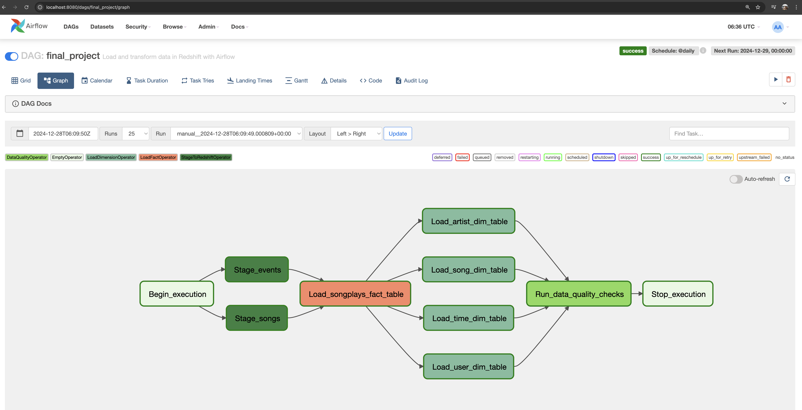
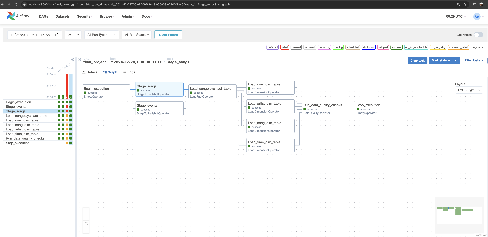
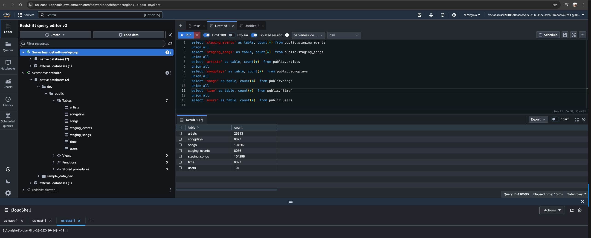

# Project: Data Pipelines with Apache Airflow

As part of this project, the source data in the S3 bucket in JSON format is processed and loaded into a data warehouse in Amazon Redshift Serverless. The pipelines consist of reusable tasks and are built using the TaskFlow API paradigm introduced as part of Apache Airflow 2.0. The pipeline development process involved setting up the Redshift instance, configuring Redshift roles, and copying raw data into the S3 bucket.

### Steps

- Create an IAM user in AWS
- Configure Redshift Serverless
- Store AWS Credentials in Airflow UI
- Store Redshift connection endpoint in Airflow UI
- Copy log_data and song_data to an S3 bucket
- Download the project template from [GitHub repository](https://github.com/udacity/cd12380-data-pipelines-with-airflow)
- Clone the GitHub repository inside a Docker Airflow container
- Use VS Code to edit the files and manage Airflow
- Use the project starter with the DAG template, the operators, and helper code 
- Configure the DAG with the data quality checks
- Ensure that the DAG runs successfully

### DAG Graph

### Airflow Successful Run

### Post-ETL SQL Query in Redshift Serverless

### Potential Improvements

The following security improvements could be considered in the production pipelines:
- In order to improve the security of AWS access keys and secrets in the StageToRedshiftOperator, use IAM roles with appropriate permissions instead of AWS credentials ID.
- Further parameterize queries to prevent SQL injection. Modify the execute methods in LoadDimensionOperator, LoadFactOperator, and StageToRedshiftOperator.
